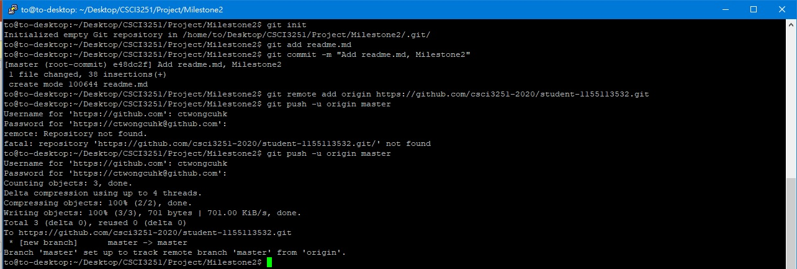

# !dlroW olleH #
## This is me: ##
My name is **Wong Chin To**. I like playing `PC games`.
I am a Year 2 student and my major is CE.
Currently, I am playing the `Jetson Nano` and `Raspberry Pi`.
I think it is pretty funny to type in CLI.

Courses taking:
* CENG2010
* CENG3410
* CENG3430
* ELEG3202
* ENGG2430
* CSCI3250
* CSCI3251
* ELTU3014
## Things about computer I have "learnt" or now learning: ##
* C
* C++
* Python (Learning)
* Java
* VHDL
* Verilog
## My skills ##
Language | No good | OK | relatively good |
 --- |:---:|:---:|:---:|
C |  |  | V |
C++ |  |  | V |
Python | V |  |  |
Java |  | V |  |
VHDL |  |  | V |
Verilog |  | V |  |

## Things need to do ##
- [ ] ~~Relax myself~~
- [x] Use SBC to make something
## This sem chur af... ##
~~This is the end of my presentation, thank you!~~
## Screen Shot ##

